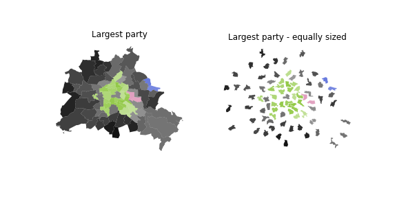

# berlin-results-2023

The notebook `results.ipynb` plots cartograms and maps of the elections results in Berlin in 2023, showing the distortionary effects of chloropleth maps (and maps in general, given the absence of a first past the post system)

